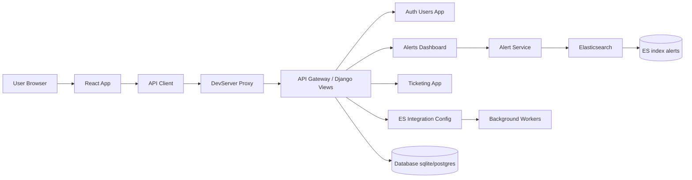

# SIEM Platform

This project is a Security Information and Event Management (SIEM) platform built with a Django backend and a React frontend.


## Features
- Multi-tenancy support
- JWT-based authentication
- Modular design for users, alerts, and ticketing
- Ant Design for a modern UI

## Prerequisites
- Node.js (v16 or higher)
- Python (v3.9 or higher)
- SQLite (for development)

## Setup Instructions

### Backend
1. Navigate to the backend directory:
   ```bash
   cd backend
   ```
2. Create a virtual environment and activate it:
   ```bash
   python -m venv venv
   source venv/bin/activate
   venv\Scripts\Activate.ps1

   ```
3. Install dependencies:
   ```bash
   pip install -r requirements.txt
   ```
4. Apply migrations:
   ```bash
   python manage.py migrate
   ```
5. Seed tenants (optional):
   ```bash
   python manage.py seed_tenants
   ```
6. Start the development server:
   ```bash
   python manage.py runserver
    python manage.py  scheduler --interval 30
   ```

7. 使用 PostgreSQL（可选）：

   - 如果你希望在开发或生产中使用 PostgreSQL（而不是 SQLite），请先在 `backend/siem_project/settings.py` 中修改 `DATABASES` 配置，示例：

   ```python
   DATABASES = {
      'default': {
         'ENGINE': 'django.db.backends.postgresql',
         'NAME': 'siem_db',
         'USER': 'siem_user',
         'PASSWORD': 'your_password',
         'HOST': 'localhost',
         'PORT': '5432',
      }
   }
   ```

   - 然后在 `backend` 目录下运行迁移以把模型写入 Postgres：

   ```powershell
   cd backend
   venv\Scripts\Activate.ps1   # Windows PowerShell 环境激活（或使用相应的激活命令）
   pip install -r requirements.txt
   python manage.py migrate
   ```

   - 额外说明：本仓库中我已手动添加了两个 migration 文件，用于创建 `TaskRequestLog` 与 `ESMapping` 两张表（用于把原先写到磁盘的集成映射与调度请求日志持久化到数据库）。运行 `migrate` 会应用这些迁移，从而将这些配置持久化到你配置的数据库中。

   - 如果你在迁移中遇到问题，请把 `python manage.py migrate` 输出的错误发给我，我会帮助定位并修复。

### Frontend
1. Navigate to the frontend directory:
   ```bash
   cd frontend
   ```
2. Install dependencies:
   ```bash
   npm install
   ```
3. Start the development server:
   ```bash
   npm start
   ```

## Usage
- Open your browser and navigate to `http://localhost:3000` for the frontend.
- The backend API is available at `http://localhost:8000`.

## Folder Structure
```
SIEM/
├── backend/   # Django backend
├── frontend/  # React frontend
└── README.md  # Project documentation
```

## License
This project is licensed under the MIT License.
 
## Architecture (系统架构说明)

下面给出一个较为详细的架构图，包含前端、后端、Elasticsearch、持久层与后台任务等组件，以及数据流向、端口和 ES vs 测试模式 的切换说明。



如果无法渲染 mermaid（例如某些渲染器不支持），下面给出一个 ASCII 版本供快速阅读：

```
[User Browser]
       |
       v
[React Frontend] -- axios --> [DevServer Proxy/Nginx] --> [Django API]
                                                                |
                                                                v
                        [AlertService]
                          |
                          v
                       [Elasticsearch]
                        |
                        v
                     [ES index: alerts]

Other components:
- Auth/users app -> handles JWT and tenant_id
- Ticketing app -> creates/updates tickets
- DB (sqlite/postgres) -> stores users, configs
- Background workers -> optional; send webhooks or process async tasks
```

### 关键点说明（详细）

- 端口与常见 URL：
   - 前端开发服务器: http://localhost:3000 (可用 PORT 环境变量切换)
   - 后端 Django: http://localhost:8000
   - Elasticsearch: http://localhost:9200

 - 模式选择（es / auto / testing）：
   - 前端通过 ModeContext 在 UI 中控制数据源选择（例如自动 / 强制 ES / 测试）。
   - 后端的 `ESIntegrationConfig` 为按租户配置；当 `enabled` 时，AlertService 会尝试从 ES 查询并按 `tenant_id` 过滤。

- 数据流（示例：dashboard）:
   1. 用户在浏览器打开 Dashboard，React 发起 `/api/v1/es/dashboard/` 请求。
 2. 请求到达 Django 的 Dashboard view，view 调用 `AlertService.aggregate_dashboard(tenant_id, force_es?, force_mock?)`（参数名保留以兼容现有后端实现）。
 3. `AlertService` 根据配置或强制参数选择：
       - 走 ES 客户端查询（优先） -> 聚合并返回聚合结果；或
   - 回退到 `mock_alerts.json`（或指定的测试用数据）中返回示例数据。
 4. 前端接收并渲染图表；为避免刷新时 UI 闪烁，前端会缓存最近一次成功的 dashboard payload（localStorage key: `siem_dashboard_cache_v1`）。

- 认证与持久化：
   - 登录后，前端会把 `siem_access_token`（JWT/访问令牌）和 `siem_tenant_id` 写入 localStorage，页面刷新时会从 localStorage 恢复以避免被登出。

- 异常与容错：
      - 若 ES 无响应或返回错误，后端会记录错误并返回测试用数据（保持前端可用）。
   - 若发现 Elasticsearch 中缺少 `tenant_id` 字段，查询会导致该文档被忽略（建议在索引时确保每条告警带 `tenant_id`）。

### 开发/排障要点

- 如果前端 `npm start` 报错 `EADDRINUSE` (3000 端口被占用)：
   - 检查占用者并终止：`lsof -i :3000` -> `kill <PID>`，或使用 `PORT=3001 npm start` 启动到不同端口。
- 验证 ES 是否有数据：
   - 使用 curl 检查：`curl -s -XGET 'http://localhost:9200/alerts/_count' -H 'Content-Type: application/json' -d'{"query":{"match_all":{}}}'`
- 后端日志中查看 ES 客户端报错，通常能提示认证/网络/索引名称错误。

---

1

## 功能 到 数据库 表 映射（快速参考）

下面列出主要功能模块与它们在数据库中的持久化表（以及对应的 Django 模型和源码位置），方便你查表并定位代码。

- **Integrations（集成）**:
   - 数据表: `integrations_integration`
   - Django 模型: `integrations.models.Integration`
   - 说明: 存储各类外部集成（Elasticsearch、Postgres、MySQL 等）的连接参数与元数据（`config` JSONField）。
   - 文件: [backend/integrations/models.py](backend/integrations/models.py)

- **Elasticsearch 租户配置**:
   - 数据表: `es_integration_esintegrationconfig`
   - Django 模型: `es_integration.models.ESIntegrationConfig`
   - 说明: 每个租户的 ES 主机/索引/认证配置。
   - 文件: [backend/es_integration/models.py](backend/es_integration/models.py)

- **ES → SQL 映射（新增）**:
   - 数据表: `integrations_esmapping`
   - Django 模型: `integrations.models.ESMapping`
   - 说明: 存储从 ES 索引到目标 SQL 表的列映射（用于同步/创建表时使用）。
   - 文件: [backend/integrations/models.py](backend/integrations/models.py)

- **Dashboards（仪表盘）**:
   - 数据表: `dashboards_dashboard`
   - Django 模型: `dashboards.models.Dashboard`
   - 说明: 仪表盘元数据（layout, widgets），以及 Dashboard 级时间选择器字段（`timestamp_field`, `time_selector`, `timestamp_from`, `timestamp_to` 等）。
   - 文件: [backend/dashboards/models.py](backend/dashboards/models.py)

- **DataSource / DataSet（数据源/数据集）**:
   - 数据表: `datasource_datasource`, `datasource_dataset`
   - Django 模型: `datasource.models.DataSource`, `datasource.models.DataSet`
   - 说明: 保存数据库连接信息（DataSource）以及内存或 SQL 查询型的数据集（DataSet）。
   - 文件: [backend/datasource/models.py](backend/datasource/models.py)

- **Orchestrator（编排器/任务）**:
   - 数据表: `orchestrator_task`, `orchestrator_taskrun`, `orchestrator_taskrequestlog`
   - Django 模型: `orchestrator.models.Task`, `orchestrator.models.TaskRun`, `orchestrator.models.TaskRequestLog`
   - 说明: `Task` 保存任务定义（含 `config` JSON），`TaskRun` 保存每次执行记录，`TaskRequestLog` 保存通过 API 创建/更新任务时的审计请求（我把原先写到磁盘的 request log 改为存到 DB）。
   - 文件: [backend/orchestrator/models.py](backend/orchestrator/models.py)

- **Orchestrator 生成文件（兼容）**:
   - 目录: `backend/generated_tasks/`
   - 说明: 系统仍会根据 `Task.config` 生成 runner 脚本和 task config JSON 到此目录以供外部 runner 使用；写文件行为受 `WRITE_CONFIG_TO_DISK` 设置控制（默认关闭）。
   - 文件: [backend/orchestrator/views.py](backend/orchestrator/views.py)

- **ES 报表/采样/统计（es_integration）**:
   - 数据表: `es_integration_alert`, `es_integration_dashboardstats`, `es_integration_esintegrationconfig`
   - Django 模型: `es_integration.models.Alert`, `es_integration.models.DashboardStats`, `es_integration.models.ESIntegrationConfig`
   - 文件: [backend/es_integration/models.py](backend/es_integration/models.py)

