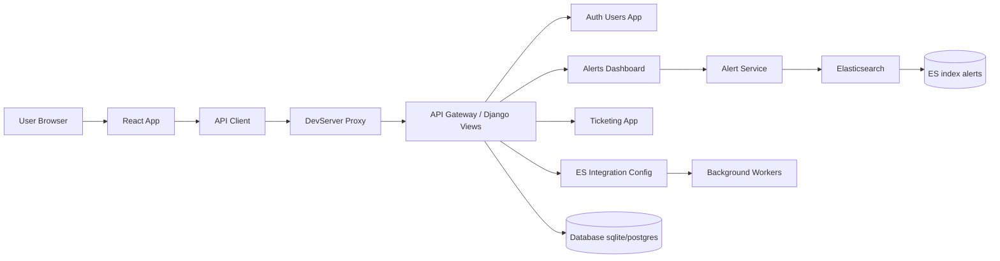

# SIEM Platform

This project is a Security Information and Event Management (SIEM) platform built with a Django backend and a React frontend.


## Features
- Multi-tenancy support
- JWT-based authentication
- Modular design for users, alerts, and ticketing
- Ant Design for a modern UI

## Prerequisites
- Node.js (v16 or higher)
- Python (v3.9 or higher)
- SQLite (for development)

## Setup Instructions

### Backend
1. Navigate to the backend directory:
   ```bash
   cd backend
   ```
2. Create a virtual environment and activate it:
   ```bash
   python -m venv venv
   source venv/bin/activate
   ```
3. Install dependencies:
   ```bash
   pip install -r requirements.txt
   ```
4. Apply migrations:
   ```bash
   python manage.py migrate
   ```
5. Seed tenants (optional):
   ```bash
   python manage.py seed_tenants
   ```
6. Start the development server:
   ```bash
   python manage.py runserver
   ```

### Frontend
1. Navigate to the frontend directory:
   ```bash
   cd frontend
   ```
2. Install dependencies:
   ```bash
   npm install
   ```
3. Start the development server:
   ```bash
   npm start
   ```

## Usage
- Open your browser and navigate to `http://localhost:3000` for the frontend.
- The backend API is available at `http://localhost:8000`.

## Folder Structure
```
SIEM/
├── backend/   # Django backend
├── frontend/  # React frontend
└── README.md  # Project documentation
```

## License
This project is licensed under the MIT License.
 
## Architecture (系统架构说明)

下面给出一个较为详细的架构图，包含前端、后端、Elasticsearch、持久层与后台任务等组件，以及数据流向、端口和 ES vs 测试模式 的切换说明。



如果无法渲染 mermaid（例如某些渲染器不支持），下面给出一个 ASCII 版本供快速阅读：

```
[User Browser]
       |
       v
[React Frontend] -- axios --> [DevServer Proxy/Nginx] --> [Django API]
                                                                |
                                                                v
                        [AlertService]
                          |
                          v
                       [Elasticsearch]
                        |
                        v
                     [ES index: alerts]

Other components:
- Auth/users app -> handles JWT and tenant_id
- Ticketing app -> creates/updates tickets
- DB (sqlite/postgres) -> stores users, configs
- Background workers -> optional; send webhooks or process async tasks
```

### 关键点说明（详细）

- 端口与常见 URL：
   - 前端开发服务器: http://localhost:3000 (可用 PORT 环境变量切换)
   - 后端 Django: http://localhost:8000
   - Elasticsearch: http://localhost:9200

 - 模式选择（es / auto / testing）：
   - 前端通过 ModeContext 在 UI 中控制数据源选择（例如自动 / 强制 ES / 测试）。
   - 后端的 `ESIntegrationConfig` 为按租户配置；当 `enabled` 时，AlertService 会尝试从 ES 查询并按 `tenant_id` 过滤。

- 数据流（示例：dashboard）:
   1. 用户在浏览器打开 Dashboard，React 发起 `/api/v1/es/dashboard/` 请求。
 2. 请求到达 Django 的 Dashboard view，view 调用 `AlertService.aggregate_dashboard(tenant_id, force_es?, force_mock?)`（参数名保留以兼容现有后端实现）。
 3. `AlertService` 根据配置或强制参数选择：
       - 走 ES 客户端查询（优先） -> 聚合并返回聚合结果；或
   - 回退到 `mock_alerts.json`（或指定的测试用数据）中返回示例数据。
 4. 前端接收并渲染图表；为避免刷新时 UI 闪烁，前端会缓存最近一次成功的 dashboard payload（localStorage key: `siem_dashboard_cache_v1`）。

- 认证与持久化：
   - 登录后，前端会把 `siem_access_token`（JWT/访问令牌）和 `siem_tenant_id` 写入 localStorage，页面刷新时会从 localStorage 恢复以避免被登出。

- 异常与容错：
      - 若 ES 无响应或返回错误，后端会记录错误并返回测试用数据（保持前端可用）。
   - 若发现 Elasticsearch 中缺少 `tenant_id` 字段，查询会导致该文档被忽略（建议在索引时确保每条告警带 `tenant_id`）。

### 开发/排障要点

- 如果前端 `npm start` 报错 `EADDRINUSE` (3000 端口被占用)：
   - 检查占用者并终止：`lsof -i :3000` -> `kill <PID>`，或使用 `PORT=3001 npm start` 启动到不同端口。
- 验证 ES 是否有数据：
   - 使用 curl 检查：`curl -s -XGET 'http://localhost:9200/alerts/_count' -H 'Content-Type: application/json' -d'{"query":{"match_all":{}}}'`
- 后端日志中查看 ES 客户端报错，通常能提示认证/网络/索引名称错误。

---

